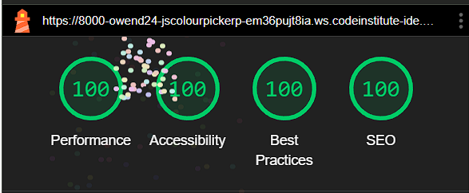

# Colour Palette Generator

## Live Site

https://owend-24.github.io/JS-Colour-Picker-Project/index.html

## Brief Introduction

The Colour Palette Generator is a responsive frontend web application that allows users to generate and view random colour palettes.

Users can click on colour cards to copy HEX colour codes to their clipboard, generate new palettes using a button, refresh the palette, and use keyboard shortcuts for a faster workflow.

## Responsivity Example

## Contents

1. [UX - User Experience](#1-ux---user-experience)

   * [User Stories](#user-stories)
   * [Strategy](#strategy)
   * [Scope](#scope)
   * [Structure](#structure)
   * [Skeleton](#skeleton)
   * [Wireframe](#wireframe)
   * [Surface](#surface)
2. [Design](#2-design)

   * [Typography](#typography)
   * [Colour Scheme](#colour-scheme)
   * [Imagery](#imagery)
3. [Features](#3-features)
4. [Tablet and Mobile View](#4-tablet-and-mobile-view)
5. [Future Features](#5-future-features)
6. [Technologies Used](#6-technologies-used)
7. [Deployment](#7-deployment)
8. [Testing](#8-testing)
9. [Credits](#9-credits)

## 1. UX - User Experience

### User Stories

### Strategy

The goal of this project is to provide an easy-to-use tool for generating colour palettes.

The design focuses on simplicity, speed and usability, giving users a quick way to generate colours and copy HEX codes for design or development work.

### Scope

The application generates a set of colour cards, each displaying a different random colour.

Users can interact with these cards to copy colour codes, generate new palettes and refresh the interface using buttons or keyboard shortcuts.

### Structure

* **Header**: Contains the logo and main heading.
* **Main Content**: Displays the colour card grid and palette control buttons.
* **Footer**: Contains social links and copyright information.

### Skeleton

The layout uses a responsive grid system to keep the colour cards flexible across different screen sizes.

The page structure is designed to keep the main colour generation tool clear, accessible and easy to use.

### Wireframe

### Surface

The design uses Tailwind CSS for clean utility-first styling.

The interface uses bright colour cards, clear spacing and interactive visual feedback to make the app simple and engaging to use.

## 2. Design

### Typography

* **Primary Font**: Tailwind CSS default font stack
* **Font Sizes**: Different font sizes are used for headings, body text, buttons and colour labels.

### Colour Scheme

* **Background Colour**: Gray `#f7fafc`
* **Primary Colour**: Sky Blue `#38bdf8`
* **Accent Colours**: Randomly generated shades across red, orange, yellow, green, blue and other colour ranges.

### Imagery

* **Logo**: `assets/js/images/logo.png`
* **Favicon**: `assets/js/images/favicon.png`

## 3. Features

* Generate random colour palettes
* Copy HEX colour codes directly to the clipboard
* Refresh the palette using a button or keyboard shortcut
* Responsive layout for desktop, tablet and mobile
* Visual notification when a colour is copied

### JavaScript Functionality

* **Event Listeners**: Handles colour card clicks, button clicks and keyboard shortcuts.
* **Palette Generation**: Generates random HEX colours and updates the colour cards dynamically.
* **Clipboard Copying**: Uses the Clipboard API to copy colour codes.
* **Notifications**: Displays feedback when a colour has been copied.

## 4. Tablet and Mobile View

The website is designed to be responsive using Tailwind CSS and flexible grid layouts.

The layout adapts across desktop, tablet and mobile screens to maintain readability and usability.

## 5. Future Features

* **Previous Palette History**: Allow users to go back to previously generated palettes.
* **Custom Colour Palette Creation**: Allow users to create and save their own palettes.
* **Colour Contrast Analysis**: Provide feedback on colour contrast for accessibility.
* **Export Palette**: Allow users to export palettes as an image or text file.
* **Save Favourite Palettes**: Let users store palettes for later use.

## 6. Technologies Used

### Languages

* HTML
* CSS
* JavaScript

### Frameworks, Libraries and APIs

* **Tailwind CSS**: Used for utility-first styling and responsive layout.
* **Clipboard API**: Used to copy colour codes directly to the clipboard.
* **Font Awesome**: Used for footer icons.

### Tools

* **GitHub**: Used for version control.
* **GitHub Pages**: Used for deployment.

## 7. Deployment

The project is deployed using GitHub Pages.

## 8. Testing

### Colour Contrast

The interface was checked using a WCAG contrast checker extension.

### Validation

**HTML and CSS** were validated using the W3C HTML Validator.

**JavaScript** was tested through browser console checks and manual interaction testing.

### Lighthouse Audits

Lighthouse audits were used to check performance, accessibility and best practices.

### Bugs Fixed

* Fixed Tailwind-related console errors.
* Fixed colour card responsiveness issues.
* Improved clipboard copying functionality.
* Fixed event listener issues.
* Fixed layout distortion affecting palette cards.

## 9. Credits

### References

* JavaScript, HTML and CSS documentation were used to support development and debugging.
* W3Schools was used as a reference for JavaScript event listeners and DOM functionality.
* Tailwind CSS documentation was used for utility-first styling and responsive layout support.

### Libraries and Tools

* Tailwind CSS for styling and responsive layout.
* Font Awesome for footer icons.
* GitHub Pages for deployment.

### Development Support

* AI tools were used for debugging guidance, validation support and improving implementation ideas during development.
